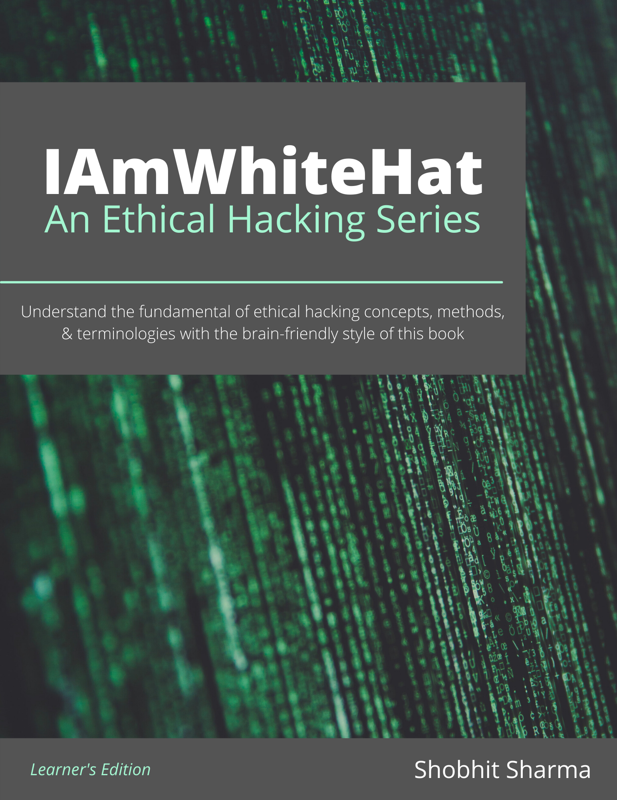

# #IAmWhiteHat
#IAmWhiteHat - An Ethical Hacking Series by Shobhit Sharma aka ScriptKKiddie officially on www.technical0812.com

# Table of Contents

- #IAmWhiteHat: C1 - Intro to Ethical Hacking: Overview | Technical 0812 

  https://www.technical0812.com/post/iamwhitehat-c1-intro-to-ethical-hacking-overview-technical-0812

- #IAmWhiteHat: C1 - Intro to Ethical Hacking: Elements of Information Security | Technical 0812 

  https://www.technical0812.com/post/iamwhitehat-c1-intro-to-ethical-hacking-elements-of-information-security-technical-0812
  
- #IAmWhiteHat: C1 - Intro to Ethical Hacking: The Security, Functionality, and Usability Triangle | Technical 0812
  
  https://www.technical0812.com/post/iamwhitehat-c1-intro-to-ethical-hacking-the-security-functionality-and-usability-triangle
  
  
## Resources 

### Tools

Module Number | Module Name
------------- | -----------
01 | Footprint and Reconnaissance
02 | Scanning Networks
03 | Enumeration
04 | Vulnerability Analysis
05 | System Hacking
06 | Malware Threats
07 | Sniffing
08 | Social Engineering
09 | Denial-of-Service
10 | Session Hijacking 
11 | Evading IDS, Firewalls, and Honeypots
12 | Hacking Web Servers
13 | Hacking Web Applications 
14 | SQL Injection
15 | Hacking Wireless Networks
16 | Hacking Mobile Platforms
17 | IoT and OT Hacking
18 | Cloud Computing
19 | Cryptography
